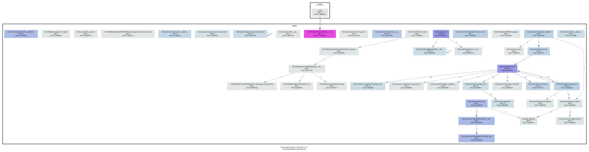
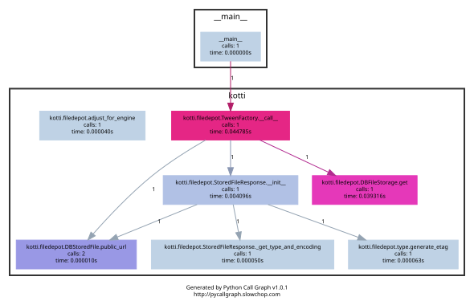

# Developer Manual

Read the [Configuration](configuration.md) section first to understand which hooks both integrators and developers can use to customize and extend Kotti.

## Screencast tutorial

Here's a screencast that guides you through the process of creating a simple Kotti add-on for visitor comments:

<iframe width="640" height="480" src="http://www.youtube-nocookie.com/embed/GC3tw6Tli54?rel=0" frameborder="0" allowfullscreen></iframe>

## Content types {#content-types}

Defining your own content types is easy.
The implementation of the Document content type serves as an example here:

```python
from kotti.resources import Content

class Document(Content):
    id = Column(Integer(), ForeignKey('contents.id'), primary_key=True)
    body = Column(UnicodeText())
    mime_type = Column(String(30))

    type_info = Content.type_info.copy(
        name=u'Document',
        title=_(u'Document'),
        add_view=u'add_document',
        addable_to=[u'Document'],
        )

    def __init__(self, body=u"", mime_type='text/html', **kwargs):
        super(Document, self).__init__(**kwargs)
        self.body = body
        self.mime_type = mime_type
```

The `add_view` parameter of the `type_info` attribute is the name of a view that can be used to construct a `Document` instance.
This view has to be available for all content types specified in `addable_to` parameter.
See the section below and the [adding forms and a view](../../guides/getting-started/tut-2.md#adding-forms-and-a-view) section in the tutorial on how to define a view restricted to a specific context.

You can configure the list of active content types in Kotti by modifying the [`kotti.available_types`](configuration.md#kottia-available-types) setting.

Note that when adding a relationship from your content type to another Node, you will need to add a `primaryjoin` parameter to your relationship.
An example:

```python
from sqlalchemy.orm import relationship

class DocumentWithRelation(Document):
  id = Column(Integer, ForeignKey('documents.id'), primary_key=True)
  related_item_id = Column(Integer, ForeignKey('nodes.id'))
  related_item = relationship(
      'Node', primaryjoin='Node.id==DocumentWithRelation.related_item_id')
```

## Add views, subscribers and more

[`pyramid.includes`](configuration.md#pyramid-includes) allows you to hook `includeme` functions that you can use to add views, subscribers, and more aspects of Kotti.
An `includeme` function takes the *Pyramid Configurator API* object as its sole argument.

Here's an example that'll override the default view for Files:

```python
def my_file_view(request):
    return {...}

def includeme(config):
    config.add_view(
        my_file_view,
        name='view',
        permission='view',
        context=File,
        )
```

To find out more about views and view registrations, please refer to the [Pyramid documentation](http://docs.pylonsproject.org/projects/pyramid/en/latest/).

By adding the *dotted name string* of your `includeme` function to the [`pyramid.includes`](configuration.md#pyramid-includes) setting, you ask Kotti to call it on application start-up.
An example:

```ini
pyramid.includes = mypackage.views.includeme
```

## Working with content objects

Kotti's content tree is built on SQLAlchemy and Pyramid's traversal.
Every content object is a `Node` subclass stored in the database.
Nodes can have children (forming a tree), and each node has an ACL for security.

For the full testing fixture that exercises content object behavior, see
[`kotti/tests/`](https://github.com/Kotti/Kotti/tree/master/kotti/tests) in the source.

Also see:

- [`kotti.views.slots`](../../api/kotti.views/kotti.views.slots.md) — portlets/slots API
- [`kotti.events`](../../api/kotti.events.md) — event system

## How requests are served

The following diagrams illustrate how Kotti serves requests — both directly and through a tween:





## `kotti.configurators`

Requiring users of your package to set all the configuration settings by hand in the Paste Deploy INI file is not ideal.
That's why Kotti includes a configuration variable through which extending packages can set all other INI settings through Python.
Here's an example of a function that programmatically modified `kotti.base_includes` and `kotti.principals_factory` which would otherwise be configured by hand in the INI file:

```python
# in mypackage/__init__.py
def kotti_configure(config):
    config['kotti.base_includes'] += ' mypackage.views'
    config['kotti.principals_factory'] = 'mypackage.security.principals'
```

And this is how your users would hook it up in their INI file:

```ini
kotti.configurators = mypackage.kotti_configure
```

## Security {#develop-security}

Kotti uses [Pyramid's security API](http://docs.pylonsproject.org/projects/pyramid/dev/api/security.html), most notably its support for [inherited access control lists](http://docs.pylonsproject.org/projects/pyramid/en/latest/narr/security.html#acl-inheritance-and-location-awareness).
On top of that, Kotti defines *roles* and *groups* support: Users may be collected in groups, and groups may be given roles, which in turn define permissions.

The site root's ACL defines the default mapping of roles to their permissions:

```python
root.__acl__ == [
    ['Allow', 'system.Everyone', ['view']],
    ['Allow', 'role:viewer', ['view']],
    ['Allow', 'role:editor', ['view', 'add', 'edit']],
    ['Allow', 'role:owner', ['view', 'add', 'edit', 'manage']],
    ]
```

Every Node object has an `__acl__` attribute, allowing the definition of localized row-level security.

The [`kotti.security.set_groups`](../../api/kotti.security.md) function allows assigning roles and groups to users in a given context.
[`kotti.security.list_groups`](../../api/kotti.security.md) allows one to list the groups of a given user.
You may also set the list of groups globally on principal objects, which are of type [`kotti.security.Principal`](../../api/kotti.security.md).

Kotti delegates adding, deleting and search of user objects to an interface it calls [`kotti.security.AbstractPrincipals`](../../api/kotti.security.md).
You can configure Kotti to use a different `Principals` implementation by pointing the `kotti.principals_factory` configuration setting to a different factory.
The default setting here is:

```ini
kotti.principals_factory = kotti.security.principals_factory
```

There are views that you might want to override when you override the principal factory.
That is, if you use different columns in the database, then you will probably want to make changes to the deform schema as well.

These views are [`kotti.views.users.UsersManage`](../../api/kotti.views/kotti.views.users.md), [`kotti.views.users.UserManage`](../../api/kotti.views/kotti.views.users.md) and [`kotti.views.users.Preferences`](../../api/kotti.views/kotti.views.users.md).
Notice that you should override them using the standard way, that is, by overriding `setup-users`, `setup-user` or `prefs` views.
Then you can override any sub-view used inside them as well as include any logic for your usecase when it is called, if needed.
